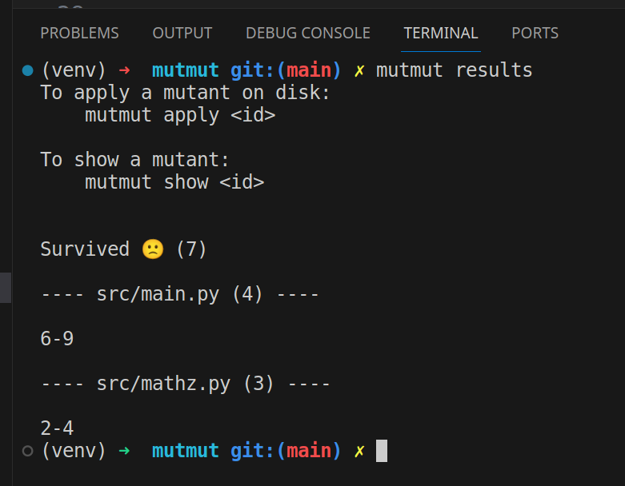

- [Setup](#setup)
  - [Requirements](#requirements)
  - [Install](#install)
- [Run Unit Tests](#run-unit-tests)
- [Run Mutation Testing](#run-mutation-testing)
- [Run App](#run-app)
- [Reporters](#reporters)
  - [Propriatary CLI](#propriatary-cli)
  - [HTML](#html)
  - [junitxml](#junitxml)

## Setup

### Requirements

- Python 3.8+
- 🚨 Does not work on Windows! 🚨

### Install

`pip install -r requirements.txt`

## Run Unit Tests

`python -m unittest discover -s tests`

## Run Mutation Testing

https://github.com/boxed/mutmut

`mutmut run`

## Run App

`python main.py`

## Reporters

https://github.com/boxed/mutmut

### Propriatary CLI

`mutmut show`

### HTML

`mutmut html`

See files in `example-report` ([link](example-report/html/index.html))

### junitxml

https://github.com/testmoapp/junitxml

`mutmut junitxml`

See files in `example-report` ([link](example-report/junit.xml))
