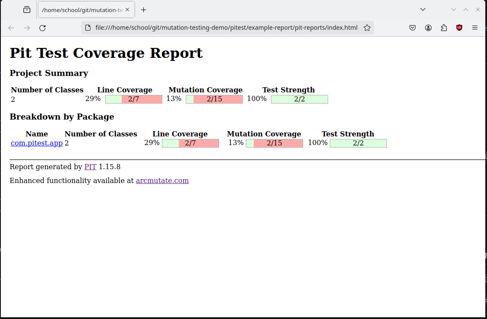

- [Setup](#setup)
  - [Requirements](#requirements)
  - [Install](#install)
- [Run Unit Tests](#run-unit-tests)
- [Run Mutation Testing](#run-mutation-testing)
- [Run App](#run-app)
- [Reports](#reports)
  - [HTML](#html)
  - [CSV](#csv)
  - [XML](#xml)

## Setup

### Requirements

- Java 21
- Maven

### Install

`curl -s "https://get.sdkman.io" | bash` \
`sdk install java` \
`sdk install maven`

## Run Unit Tests

`mvn test`

## Run Mutation Testing

`mvn test-compile org.pitest:pitest-maven:mutationCoverage`

> "This will output an html report to `target/pit-reports/YYYYMMDDHHMI`."

(https://pitest.org/quickstart/maven/)

## Run App

`mvn run`

## Reports

Set with `outputFormats` https://pitest.org/quickstart/maven/

- HTML
- XML
- CSV.

### HTML

Stryker-like dashboard

### CSV

See files in `example-report`.

### XML

See files in `example-report`.
